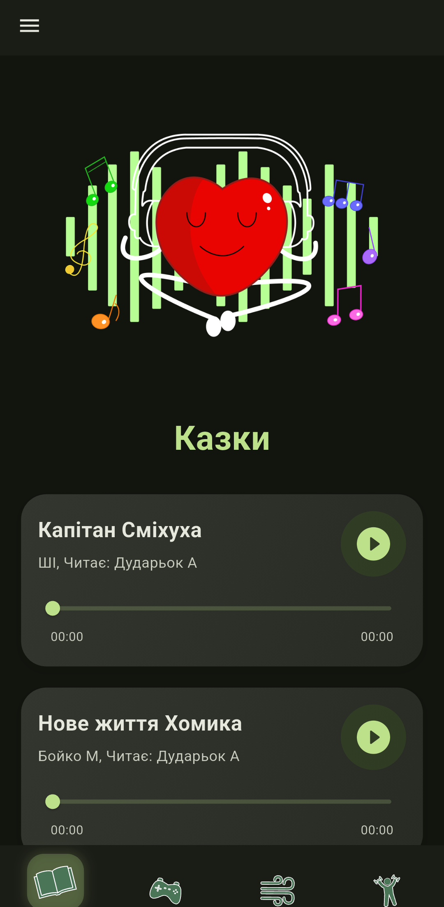
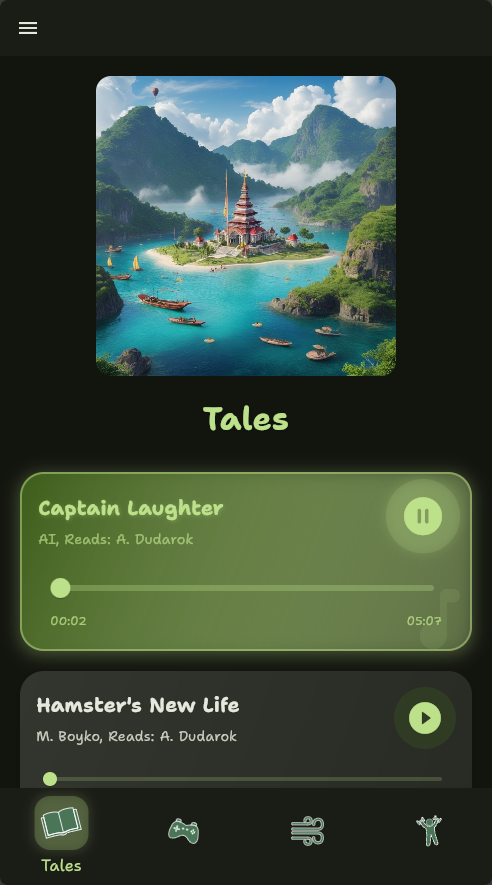
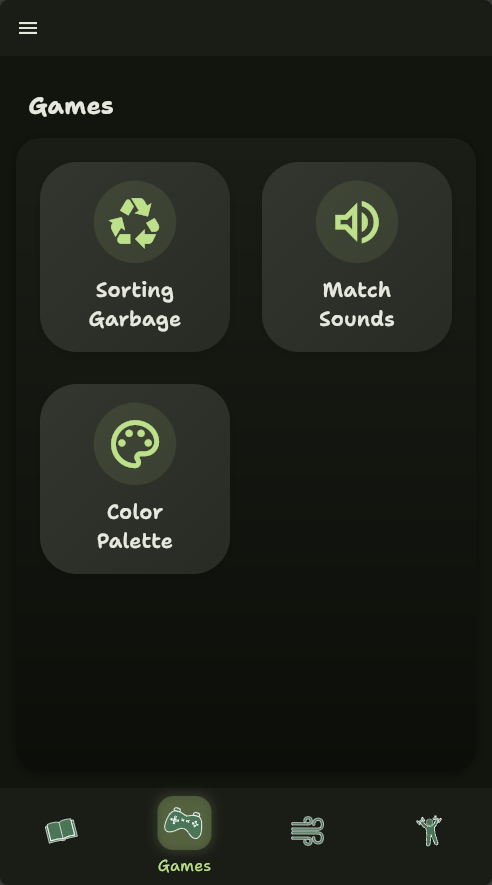
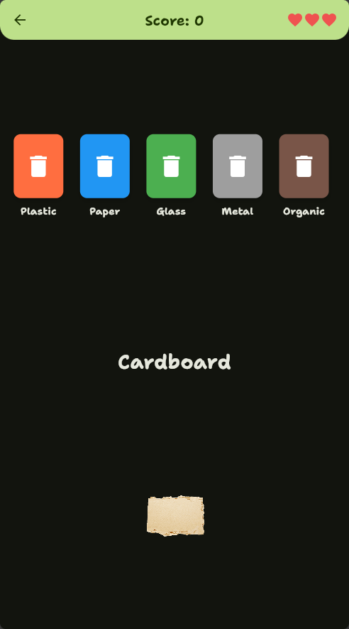
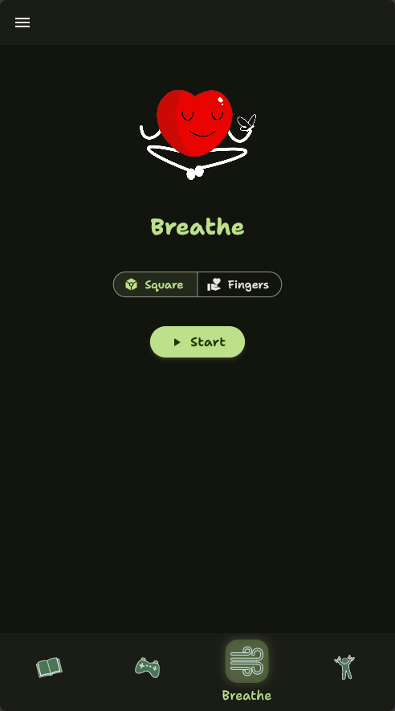
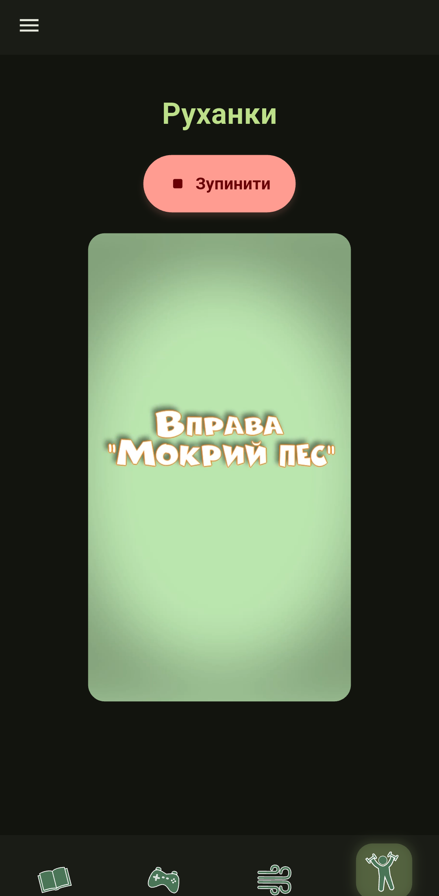

<p align="center">
  
</p>

<p align="center">
  <h1 align="center">QuietHeart</h1>
</p>

<p align="center">
  <a href="README.md">English</a> |
  <a href="README.uk.md">Українська</a>
</p>

QuietHeart is a Flutter-based mobile application designed to promote mindfulness, relaxation, and emotional well-being for children. The app provides a variety of calming activities, engaging games, and guided breathing exercises in a child-friendly interface.

## Features

### 🎧 Tales

Listen to soothing stories that help children relax and develop emotional intelligence. The app includes multiple tales available in several languages (Ukrainian, English, and Hebrew).

### 🎮 Games

Engage with educational and calming games:

-   **Sorting Groceries Game**: Learn about food categories and organization
-   **Matching Sounds**: Develop auditory recognition by matching different sounds
-   **Color Palette**: Explore colors and creativity in a relaxing activity

### 🫁 Breathing Exercises

Follow guided breathing animations designed to help children regulate their emotions and reduce anxiety. Different visual patterns help guide the breathing experience.

### 🏃 Motion Activities

Access physical activities designed to help channel energy positively and promote mindful movement.

## Multilingual Support

QuietHeart is available in:

-   🇺🇦 Ukrainian
-   🇬🇧 English
-   🇮🇱 Hebrew

## Customization

-   **Theme Options**: Choose between light, dark, or system theme
-   **Language Selection**: Easily switch between supported languages

## Technical Details

### Built With

-   Flutter/Dart
-   Material Design 3
-   Provider for state management

### Key Packages

-   `audioplayers` - For playing audio tales and sounds
-   `video_player` & `chewie` - For breathing exercise videos
-   `flutter_svg` - For high-quality vector graphics
-   `google_fonts` - For beautiful typography using Shantell Sans
-   `flutter_localizations` - For multilingual support

### Architecture

The app follows a clean, modular structure with:

-   Tab-based navigation for main features
-   Animated transitions for pleasant user experience
-   Responsive design that works on various device sizes
-   Theme-aware components that adapt to light/dark modes

## Getting Started

### Prerequisites

-   Flutter SDK (latest stable version)
-   Dart SDK
-   Android Studio / Xcode for deployment

### Installation

1. Clone the repository

```bash
git clone https://github.com/yourusername/quietheart.git
```

2. Navigate to the project directory

```bash
cd quietheart
```

3. Get dependencies

```bash
flutter pub get
```

4. Run the app

```bash
flutter run
```

## Screenshots

<details>
<summary>Click to expand</summary>








</details>

---

<p align="center">Made with ❤️ for children's wellbeing</p>
